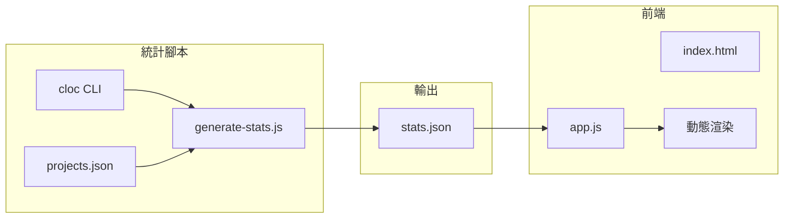

# Muripo Wrapped 2025 年度回顧

[](https://creativecommons.org/licenses/by-nc/4.0/deed.zh-hant)
[](https://developer.mozilla.org/en-US/docs/Web/JavaScript)
[](https://developer.mozilla.org/en-US/docs/Web/CSS/CSS_Scroll_Snap)

[← 回到 Muripo HQ](https://tznthou.github.io/muripo-hq/) | [English](README_EN.md)

一個類似 Spotify Wrapped 的互動式年度回顧網頁，濃縮 32 天程式冒險的精華。


> **"每天做一點，就能走很遠。"**

---

## 核心概念

**Muripo Wrapped** 是一個單頁式互動網頁，以全螢幕卡片輪播的方式，回顧 2025 年 12 月的 32 天連續專案挑戰。

### 設計理念

- **儀式感**：像打開禮物一樣，一頁一頁揭曉統計數據
- **沈浸式**：全螢幕卡片、平滑滾動、數字計數動畫
- **可分享**：最後生成一張精美的總結卡片，可下載或分享到社群

---

## 統計亮點

| 項目 | 數據 |
|------|------|
| **總專案數** | 31 個 |
| **總程式碼行數** | 112,928 行 |
| **平均每日行數** | 3,643 行 |
| **最多的一天** | Day 27 fortune-echoes (14,627 行) |
| **主力語言** | JavaScript (25,533 行) |
| **專案類型** | Web 24 / CLI 3 / Action 2 / MCP 1 / Extension 1 |

---

## 功能特色

| 功能 | 說明 |
|------|------|
| **全螢幕卡片輪播** | CSS Scroll Snap 實現平滑頁面切換 |
| **數字計數動畫** | 從 0 滾動到目標數字的視覺效果 |
| **進度條動畫** | 橫向進度條依序生長 |
| **鍵盤導航** | ↑↓←→ 或空白鍵切換頁面 |
| **進度指示器** | 右側圓點導航，可點擊跳轉 |
| **音效回饋** | Web Audio API 程式化生成音效 |
| **分享卡片** | html2canvas-pro 生成 1200×630 OG 尺寸圖片 |

---

## 頁面流程

1. **開場** - Muripo Wrapped 2025 標題
2. **總覽數字** - 31 個專案，連續 31 天
3. **程式碼行數** - 總行數、平均每日、最多的一天
4. **語言分布** - JavaScript / HTML / CSS / Python
5. **專案類型** - Web / CLI / Action / MCP / Extension
6. **愛用技術 Top 5** - 最常用的技術標籤
7. **每週節奏** - 5 週的創作節奏
8. **亮點專案** - 4 個特別閃耀的專案
9. **基礎建設** - HQ、Actions、自動化系統
10. **結語 + 分享** - 年度總結與分享卡片

---

## 技術架構

### 技術棧

| 技術 | 用途 |
|------|------|
| Vanilla JS | 主邏輯、狀態管理 |
| CSS Scroll Snap | 頁面切換效果 |
| Intersection Observer | 動畫觸發 |
| Web Audio API | 程式化音效生成 |
| html2canvas-pro | 分享卡片生成 |
| cloc | 程式碼行數統計 |

### 模組結構

| 模組 | 職責 |
|------|------|
| `app.js` | 應用入口、模組初始化 |
| `Audio` | 音效管理、Web Audio API 封裝 |
| `Animations` | 數字計數、進度條動畫 |
| `Slides` | 頁面控制、Intersection Observer |
| `Share` | 卡片生成、社群分享 |

### 資料流程



---

## 專案結構

```
day-32-muripo-wrapped/
├── index.html              # 主頁面
├── css/
│   └── style.css           # 樣式表
├── js/
│   └── app.js              # 主邏輯（含 Audio, Animations, Slides, Share）
├── data/
│   └── stats.json          # 預計算的統計數據
├── scripts/
│   └── generate-stats.js   # 統計數據生成腳本
├── assets/
│   ├── og-image.jpg        # Open Graph 預覽圖（社群分享用）
│   └── og-image.webp       # 預覽圖（README 用，更小）
├── .gitignore              # Git 忽略規則
├── package.json
├── README.md
└── README_EN.md
```

---

## 本地開發

```bash
# 複製專案
git clone https://github.com/tznthou/day-32-muripo-wrapped.git
cd day-32-muripo-wrapped

# 重新生成統計數據（需要 cloc）
npm run generate-stats

# 啟動本地伺服器
npm run dev
# 或使用任何靜態伺服器
npx live-server
```

### 前置需求

- Node.js 18+
- [cloc](https://github.com/AlDanial/cloc) - 程式碼行數統計工具

```bash
# macOS
brew install cloc

# Ubuntu/Debian
apt install cloc
```

---

## 自訂數據

### 修改亮點專案

編輯 `data/stats.json` 的 `highlights` 陣列：

```json
"highlights": [
  { "dayIndex": 30, "name": "loom-of-society", "lines": 6512, "score": 23 },
  { "dayIndex": 25, "name": "data-tapestry", "lines": 1817, "score": 22 },
  ...
]
```

### 修改基礎建設

編輯 `scripts/generate-stats.js` 的 `INFRASTRUCTURE` 常量，然後重新執行 `npm run generate-stats`。

---

## 視覺設計

### 色彩計畫

延續 Muripo HQ 風格，加入慶祝感：

| 用途 | 色彩 | 說明 |
|------|------|------|
| 背景 | `#0f172a → #1e293b` | 深色漸層，沈浸感 |
| 主色 | `#fbbf24` 琥珀金 | 成就感、慶祝 |
| 輔色 | `#38bdf8` 科技藍 | 數據、科技感 |
| 強調 | `#34d399` 翠綠 | 成功、完成 |

### 字體

- **標題**：Noto Sans TC (粗體)
- **數字**：JetBrains Mono (等寬)
- **內文**：系統字體

---

## 程式碼審查

本專案經過完整的程式碼審查，修復了 15 項問題以提升品質。

### 已修復項目

| 類別 | 數量 | 重點改進 |
|------|------|----------|
| 安全性 | 2 | CDN 版本鎖定、輸入驗證 |
| 無障礙性 | 3 | ARIA live region、鍵盤焦點樣式 |
| 記憶體管理 | 2 | DOM 清理、Observer 釋放 |
| 音訊處理 | 2 | Autoplay policy、localStorage 容錯 |
| CSS 優化 | 3 | 變數補齊、動畫效能 |
| 腳本強化 | 3 | 依賴檢查、JSON 驗證 |

### 設計決策（保留現狀）

以下項目經評估後決定不修改：

| 項目 | 原因 |
|------|------|
| Console.log | 保留方便 debug，個人專案無需移除 |
| 分享 URL 硬編碼 | 避免分享 localhost，硬編碼是正確做法 |
| Google Fonts CDN | 全球可用，無需自架 |
| 無 Error Boundary | 靜態頁面重新整理即可 |

---

## 隨想

認真地，我終於結束最後一個專案，有點依依不捨。

不過總算是對自我的挑戰結束了。我也成功完成最後一個挑戰，完成了最後的統計。

暫時告一段落，下一個步驟我們要做什麼，我自己也不知道，也還在思考方向，也許可以做一些更有趣的東西。

總之，我們之後再見，江湖再見。

---

## 授權

本作品採用 [CC BY-NC 4.0](https://creativecommons.org/licenses/by-nc/4.0/deed.zh-hant) 授權。

你可以自由：
- **分享** — 以任何媒介或格式重製及散布本素材
- **改作** — 重混、轉換、以及依本素材建立新素材

惟須遵守：
- **姓名標示** — 標註原作者與來源
- **非商業性** — 不可用於商業目的

---

## 相關專案

這是 32 天連續專案挑戰的第 32 天作品。完整專案列表請參考：

- [Muripo HQ](https://tznthou.github.io/muripo-hq/) - 專案月曆總部（含全部 31 個專案連結）

---

> **"32 天，32 個專案，無數行程式碼。這不只是一個月，這是一場證明。"**
