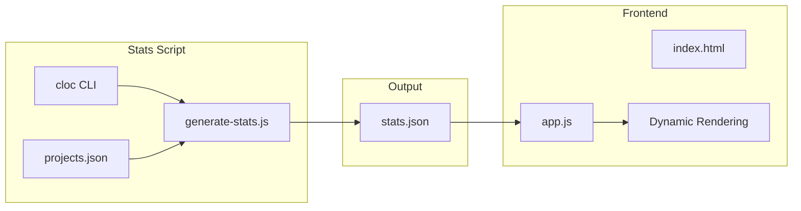

# Muripo Wrapped 2025 Annual Review

[](https://creativecommons.org/licenses/by-nc/4.0/)
[](https://developer.mozilla.org/en-US/docs/Web/JavaScript)
[](https://developer.mozilla.org/en-US/docs/Web/CSS/CSS_Scroll_Snap)

[← Back to Muripo HQ](https://tznthou.github.io/muripo-hq/) | [中文](README.md)

A Spotify Wrapped-style interactive annual review webpage, condensing the essence of a 32-day coding adventure.


> **"Do a little every day, and you can go far."**

---

## Core Concept

**Muripo Wrapped** is a single-page interactive website that reviews the 32-day consecutive project challenge of December 2025 through full-screen card carousel.

### Design Philosophy

- **Ceremony**: Reveal statistics page by page, like unwrapping a gift
- **Immersive**: Full-screen cards, smooth scrolling, number counting animations
- **Shareable**: Generate a beautiful summary card for download or social sharing

---

## Statistical Highlights

| Metric | Data |
|--------|------|
| **Total Projects** | 31 |
| **Total Lines of Code** | 112,928 |
| **Average Lines Per Day** | 3,643 |
| **Most Productive Day** | Day 27 fortune-echoes (14,627 lines) |
| **Primary Language** | JavaScript (25,533 lines) |
| **Project Types** | Web 24 / CLI 3 / Action 2 / MCP 1 / Extension 1 |

---

## Features

| Feature | Description |
|---------|-------------|
| **Full-screen Card Carousel** | Smooth page transitions with CSS Scroll Snap |
| **Number Counting Animation** | Visual effect scrolling from 0 to target |
| **Progress Bar Animation** | Horizontal bars growing sequentially |
| **Keyboard Navigation** | ↑↓←→ or spacebar to switch pages |
| **Progress Indicator** | Right-side dot navigation, clickable for jumping |
| **Sound Feedback** | Programmatically generated via Web Audio API |
| **Share Card** | 1200×630 OG-sized image via html2canvas-pro |

---

## Page Flow

1. **Opening** - Muripo Wrapped 2025 title
2. **Overview** - 31 projects, 31 consecutive days
3. **Lines of Code** - Total, daily average, peak day
4. **Language Distribution** - JavaScript / HTML / CSS / Python
5. **Project Types** - Web / CLI / Action / MCP / Extension
6. **Top 5 Technologies** - Most used tech tags
7. **Weekly Rhythm** - 5-week creation cadence
8. **Highlight Projects** - 4 standout projects
9. **Infrastructure** - HQ, Actions, automation systems
10. **Finale + Share** - Annual summary and share card

---

## Technical Architecture

### Tech Stack

| Technology | Purpose |
|------------|---------|
| Vanilla JS | Main logic, state management |
| CSS Scroll Snap | Page transition effects |
| Intersection Observer | Animation triggering |
| Web Audio API | Programmatic sound generation |
| html2canvas-pro | Share card generation |
| cloc | Lines of code statistics |

### Module Structure

| Module | Responsibility |
|--------|----------------|
| `app.js` | App entry, module initialization |
| `Audio` | Sound management, Web Audio API wrapper |
| `Animations` | Number counting, progress bar animations |
| `Slides` | Page control, Intersection Observer |
| `Share` | Card generation, social sharing |

### Data Flow



---

## Project Structure

```
day-32-muripo-wrapped/
├── index.html              # Main page
├── css/
│   └── style.css           # Stylesheet
├── js/
│   └── app.js              # Main logic (Audio, Animations, Slides, Share)
├── data/
│   └── stats.json          # Pre-calculated statistics
├── scripts/
│   └── generate-stats.js   # Statistics generation script
├── assets/
│   ├── og-image.jpg        # Open Graph preview image (social sharing)
│   └── og-image.webp       # Preview image (README, smaller)
├── .gitignore              # Git ignore rules
├── package.json
├── README.md
└── README_EN.md
```

---

## Local Development

```bash
# Clone the repo
git clone https://github.com/tznthou/day-32-muripo-wrapped.git
cd day-32-muripo-wrapped

# Regenerate statistics (requires cloc)
npm run generate-stats

# Start local server
npm run dev
# Or use any static server
npx live-server
```

### Prerequisites

- Node.js 18+
- [cloc](https://github.com/AlDanial/cloc) - Count Lines of Code tool

```bash
# macOS
brew install cloc

# Ubuntu/Debian
apt install cloc
```

---

## Customization

### Modify Highlight Projects

Edit the `highlights` array in `data/stats.json`:

```json
"highlights": [
  { "dayIndex": 30, "name": "loom-of-society", "lines": 6512, "score": 23 },
  { "dayIndex": 25, "name": "data-tapestry", "lines": 1817, "score": 22 },
  ...
]
```

### Modify Infrastructure

Edit the `INFRASTRUCTURE` constant in `scripts/generate-stats.js`, then re-run `npm run generate-stats`.

---

## Visual Design

### Color Palette

Extends Muripo HQ style with celebratory accents:

| Purpose | Color | Description |
|---------|-------|-------------|
| Background | `#0f172a → #1e293b` | Dark gradient, immersive |
| Primary | `#fbbf24` Amber Gold | Achievement, celebration |
| Secondary | `#38bdf8` Tech Blue | Data, tech feel |
| Accent | `#34d399` Emerald | Success, completion |

### Typography

- **Headings**: Noto Sans TC (Bold)
- **Numbers**: JetBrains Mono (Monospace)
- **Body**: System font stack

---

## Code Review

This project underwent a comprehensive code review, fixing 15 issues to improve quality.

### Fixed Issues

| Category | Count | Key Improvements |
|----------|-------|------------------|
| Security | 2 | CDN version locking, input validation |
| Accessibility | 3 | ARIA live region, keyboard focus styles |
| Memory Management | 2 | DOM cleanup, Observer disposal |
| Audio Handling | 2 | Autoplay policy, localStorage fallback |
| CSS Optimization | 3 | Variable definitions, animation performance |
| Script Hardening | 3 | Dependency checks, JSON validation |

### Design Decisions (Kept As-Is)

The following items were evaluated and intentionally left unchanged:

| Item | Reason |
|------|--------|
| Console.log | Kept for debugging; personal project doesn't require removal |
| Hardcoded Share URL | Prevents sharing localhost; hardcoding is correct |
| Google Fonts CDN | Globally available; no need to self-host |
| No Error Boundary | Static page; refresh is sufficient |

---

## Random Thoughts

Honestly, I've finally finished the last project, and I'm a bit reluctant to let go.

But at last, this self-imposed challenge has come to an end. I successfully completed the final challenge and wrapped up all the statistics.

For now, this chapter closes. What comes next? I'm not sure myself—still figuring out the direction. Maybe I'll create something even more interesting.

Anyway, until we meet again. See you on the other side.

---

## License

This work is licensed under [CC BY-NC 4.0](https://creativecommons.org/licenses/by-nc/4.0/).

You are free to:
- **Share** — copy and redistribute the material in any medium or format
- **Adapt** — remix, transform, and build upon the material

Under the following terms:
- **Attribution** — You must give appropriate credit
- **NonCommercial** — You may not use the material for commercial purposes

---

## Related Projects

This is Day 32 of the 32-day consecutive project challenge. For the complete project list:

- [Muripo HQ](https://tznthou.github.io/muripo-hq/) - Project calendar headquarters (all 31 projects)

---

> **"32 days, 32 projects, countless lines of code. This isn't just a month—it's proof."**
